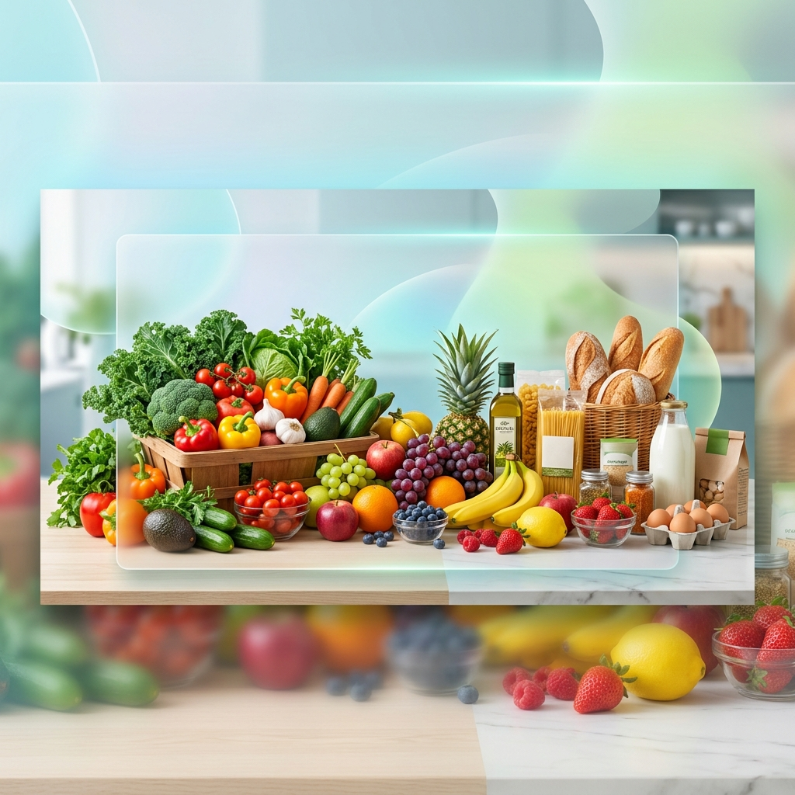

# 🛒 Online Grocery Store



A modern, full-stack E-commerce platform for online grocery shopping. This project features a robust React frontend and a scalable Express backend with MongoDB integration, providing a seamless experience for customers, administrators, and delivery personnel.

---

## 🚀 Key Features

### 👤 Customer Experience
- **Dynamic Product Catalog**: Browse a wide variety of fresh groceries with real-time stock levels.
- **Shopping Cart**: Easily add, update, and remove items from your cart.
- **Secure Checkout**: Streamlined checkout process with order confirmation.
- **User Authentication**: Secure login and registration system.
- **Profile Management**: View and update personal information.

### 🛠️ Admin Dashboard
- **Product Management**: Add, edit, and delete products from the catalog.
- **User Management**: Monitor and manage registered users.
- **Inventory Tracking**: Real-time monitoring of stock levels.

### 🚚 Delivery System
- **Delivery Dashboard**: Specialized view for managing and tracking deliveries.
- **Role-Based Access**: Secure access dedicated to delivery personnel.

---

## 🛠️ Tech Stack

### Frontend
- **Framework**: [React](https://reactjs.org/) (v18)
- **Routing**: [React Router](https://v5.reactrouter.com/) (v5)
- **State Management**: React Hooks
- **Styling**: Vanilla CSS with modern, responsive design.
- **API Client**: [Axios](https://axios-http.com/)

### Backend
- **Runtime**: [Node.js](https://nodejs.org/)
- **Framework**: [Express.js](https://expressjs.com/) (v5)
- **Database**: [MongoDB](https://www.mongodb.com/) with [Mongoose](https://mongoosejs.com/)
- **Authentication**: [JSON Web Tokens (JWT)](https://jwt.io/) & [Bcrypt.js](https://github.com/dcodeIO/bcrypt.js)
- **Environment**: [Dotenv](https://github.com/motdotla/dotenv)

---

## 🚦 Getting Started

### Prerequisites
- Node.js (v14 or higher)
- MongoDB (Running locally or on Atlas)

### Installation

1. **Clone the repository**
   ```bash
   git clone https://github.com/SharveshRam23/online-grocery.git
   cd online-grocery
   ```

2. **Install Root Dependencies**
   ```bash
   npm install
   ```

3. **Backend Setup**
   ```bash
   cd backend
   # Create a .env file based on the provided guide
   npm install
   ```

4. **Frontend Setup**
   ```bash
   cd ../frontend
   npm install
   ```

### 🗄️ Database Seeding
To populate your database with initial grocery data:
```bash
cd backend
npm run seed
```

---

## 🏃 Running the Application

You can start both the frontend and backend concurrently from the root directory:

```bash
# In the root directory
npm start
```

- **Frontend**: http://localhost:3000
- **Backend**: http://localhost:5050
- **Health Check**: http://localhost:5050/api/health

---

## 🧪 Testing

The project includes unit and integration tests for both frontend and backend.

### Backend Tests
```bash
cd backend
npm test
```

### Frontend Tests
```bash
cd frontend
npm test
```

---

## 📁 Project Structure

```text
online-grocery/
├── assets/             # Images and static assets
├── backend/            # Express server & API routes
│   ├── models/         # Mongoose schemas
│   ├── routes/         # API endpoints
│   └── seedProducts.js # Database seeding script
├── frontend/           # React application
│   ├── src/
│   │   ├── components/ # Reusable UI components
│   │   ├── pages/      # Page-level components
│   │   └── data/       # Mock data and constants
├── package.json        # Root workspace configuration
└── README.md           # Project documentation
```

---

## 📜 License
This project is licensed under the ISC License.

---

Designed with ❤️ for a premium grocery experience.
